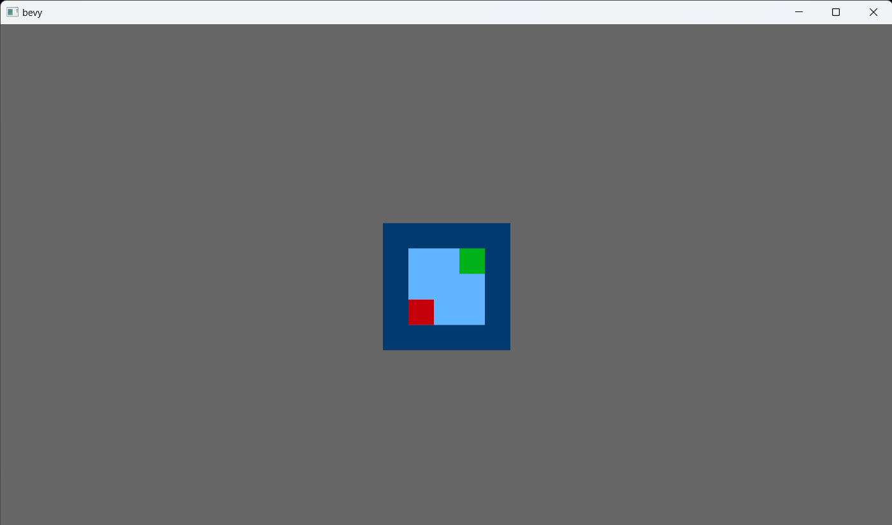

This project is conversion of https://github.com/cojuer/Castlelike into rust using bevy engine.

Actual screenshot:


Run:
```
cargo run ./cfg.yaml
```

Some implementation details taken from or inspired by:
https://github.com/MichalGniadek/roguelike-tutorial-2021